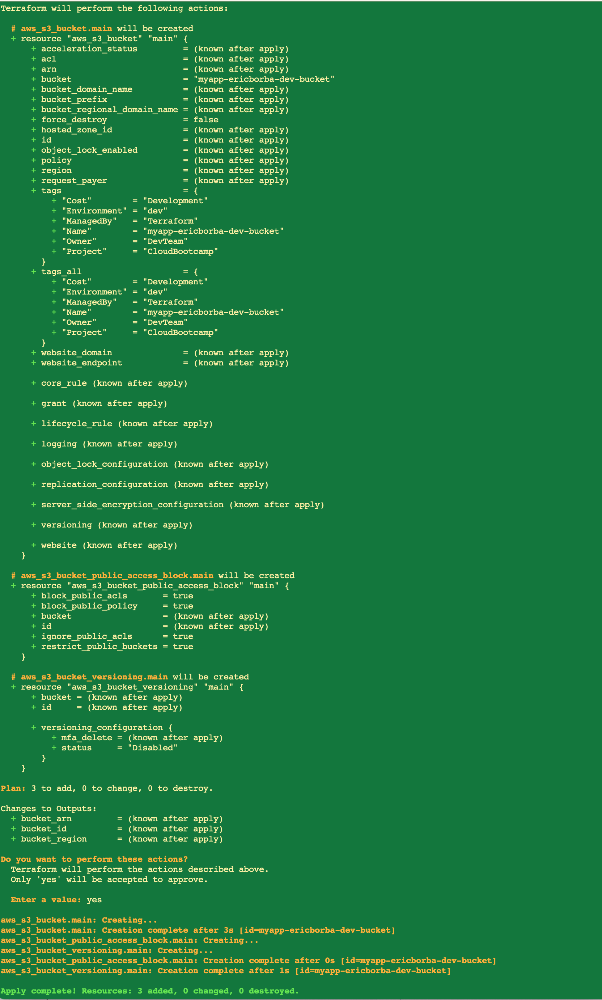
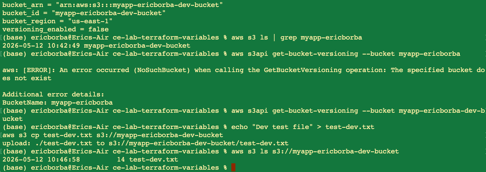
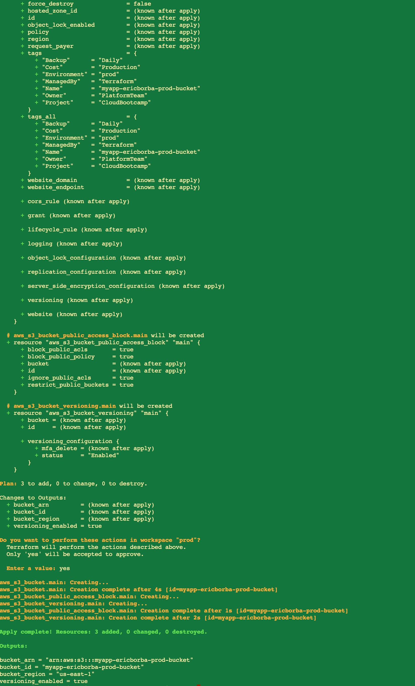
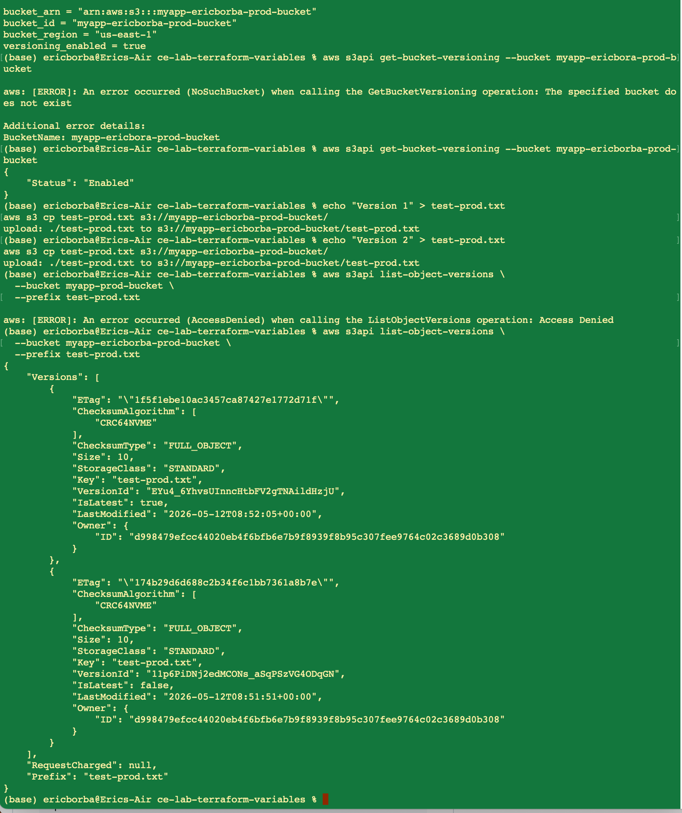
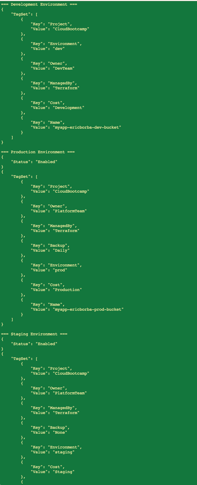
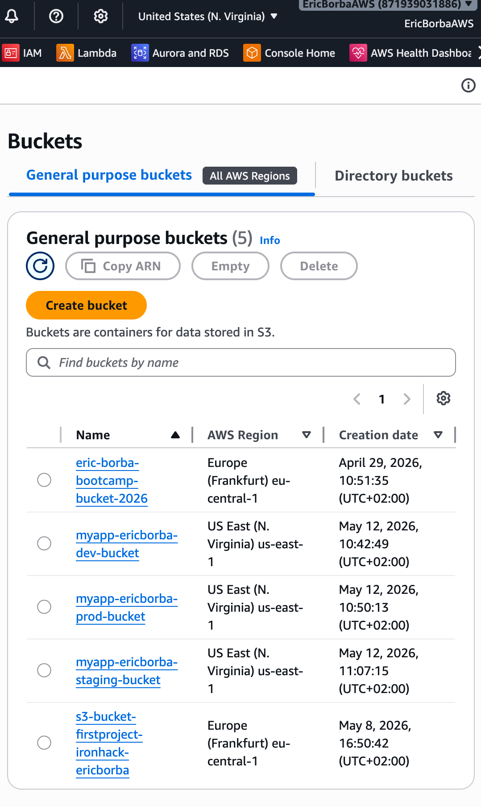

# Lab M4.02 - Variables & Parameterization with Terraform

**Student:** Eric Borba  
**Course:** Cloud Engineering Bootcamp - Week 4  
**Module:** Infrastructure as Code with Terraform  
**Date:** 2026-05-12

---

## Overview

This lab focused on making Terraform configurations flexible and reusable by replacing hardcoded values with input variables, adding validation rules, creating environment-specific `.tfvars` files, and deploying the same infrastructure across multiple environments (dev, staging, prod).

---

## What I Did

### 1. Defined Input Variables (`variables.tf`)

Created a comprehensive set of input variables covering all configurable aspects of the S3 bucket infrastructure:

| Variable | Type | Default | Purpose |
|---|---|---|---|
| `aws_region` | `string` | `"us-east-1"` | AWS region for resources |
| `environment` | `string` | — | Target environment (dev/staging/prod) |
| `bucket_prefix` | `string` | — | Prefix used to build the bucket name |
| `enable_versioning` | `bool` | `false` | Toggles S3 versioning |
| `tags` | `map(string)` | `{}` | Resource tags merged with defaults |
| `enable_encryption` | `bool` | `true` | Enables server-side encryption |
| `encryption_algorithm` | `string` | `"AES256"` | SSE algorithm (AES256 or aws:kms) |
| `kms_key_id` | `string` | `null` | Optional KMS key for aws:kms encryption |
| `enable_lifecycle_rules` | `bool` | `false` | Activates lifecycle rules |
| `lifecycle_rules` | `list(object)` | `[]` | List of lifecycle rule configurations |
| `enable_logging` | `bool` | `false` | Enables S3 access logging |
| `logging_target_bucket` | `string` | `null` | Destination bucket for access logs |
| `logging_target_prefix` | `string` | `"logs/"` | Key prefix for log objects |

### 2. Added Variable Validation Rules

Applied validation blocks to enforce safe values at plan time, preventing misconfigurations before they reach AWS:

- **`environment`**: must be one of `dev`, `staging`, or `prod`
- **`bucket_prefix`**: regex enforces only lowercase letters, numbers, and hyphens (`^[a-z0-9-]+$`)
- **`encryption_algorithm`**: constrained to `AES256` or `aws:kms`
- **`lifecycle_rules[].transition_storage_class`**: validated against the five allowed AWS storage classes

### 3. Parameterized `main.tf`

Replaced all hardcoded values with variable references:

- Bucket name is dynamically composed: `"${var.bucket_prefix}-${var.environment}-bucket"`
- Tags are built using `merge()` to combine user-supplied tags with mandatory defaults (`Name`, `Environment`, `ManagedBy`)
- Versioning status uses a conditional expression: `var.enable_versioning ? "Enabled" : "Disabled"`
- All public access block settings remain `true` regardless of environment (security baseline)

### 4. Created Environment-Specific `.tfvars` Files

Three files provide distinct configurations per environment:

**`dev.tfvars`** — cost-optimized, short-lived objects:
- Versioning disabled
- Lifecycle rule to expire objects after 30 days
- Access logging enabled
- AES256 encryption enabled

**`staging.tfvars`** — mirrors production behavior for testing:
- Versioning enabled
- Lifecycle rule to expire objects after 30 days
- AES256 encryption enabled
- Cost allocation tags corrected (`Cost = "Staging"`)

**`prod.tfvars`** — minimal, intentionally conservative:
- Versioning enabled
- Daily backup tag applied
- Additional hardening can be layered without changing `main.tf`

### 5. Deployed to Multiple Environments

Used Terraform workspaces and `-var-file` to deploy each environment independently:

```bash
# Development
terraform workspace new dev
terraform apply -var-file="dev.tfvars"

# Production
terraform workspace new prod
terraform apply -var-file="prod.tfvars"

# Staging
terraform workspace new stag
terraform apply -var-file="staging.tfvars"
```

Each workspace maintains its own state file under `terraform.tfstate.d/`.

### 6. Defined Outputs (`outputs.tf`)

Exported four outputs to make bucket details available to other modules or CI/CD pipelines:

| Output | Value |
|---|---|
| `bucket_id` | Bucket name |
| `bucket_arn` | Full ARN |
| `bucket_region` | Deployed region |
| `versioning_enabled` | Boolean reflecting the configured state |

### 7. Verified Deployments

Used a helper script (`compare-environments.sh`) to query the AWS API and confirm that each bucket was created with the correct versioning status and tags:

```bash
bash compare-environments.sh
```

---

## Screenshots

### Dev environment — `terraform apply`


### Dev environment — AWS Console verification


### Prod environment — `terraform apply`


### Prod environment — AWS Console verification


### Environment comparison script output


### AWS Console — all buckets


---

## Key Takeaways

- **Variables + validation** catch misconfiguration early, at `terraform plan` time, before any API call is made.
- **`.tfvars` files** make the same Terraform codebase serve multiple environments without duplication. The only thing that changes per environment is the variable values.
- **`merge()` for tags** is a clean pattern to enforce mandatory tags while still allowing environment-specific ones.
- **Workspaces** provide isolated state files for each environment within the same repo, avoiding accidental cross-environment modifications.
- The `optional()` type modifier in `lifecycle_rules` objects allows rules to omit fields that don't apply, keeping `.tfvars` files concise.
